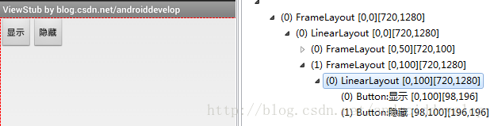
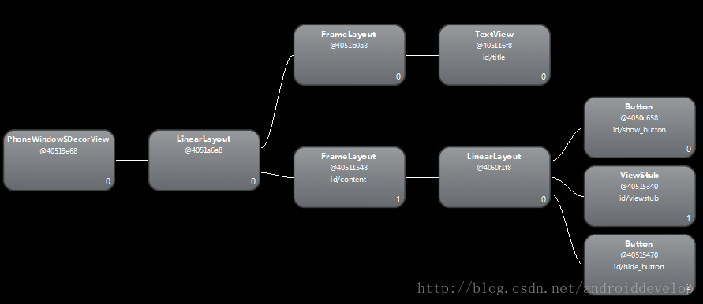
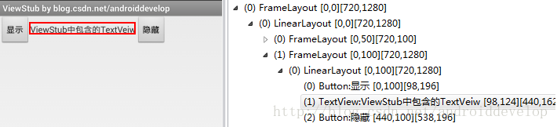

[toc]

# [转]Android 性能优化 三 布局优化ViewStub标签的使用

[原文地址 - love_world_](https://blog.csdn.net/androiddevelop/article/details/37556307)

小黑与小白的故事，通过虚拟这两个人物进行一问一答的形式来共同学习ViewStub的使用

小白：Hi，小黑，`ViewStub` 是什么？听说可以用来进行布局优化。
小黑：`ViewStub` 是一个隐藏的，不占用内存空间的视图对象，它可以在运行时延迟加载布局资源文件。（更多详细的API等信息可以查看官方文档[ViewStub](http://developer.android.com/reference/android/view/ViewStub.html)），计算机行业一向是实践里面出真知，下面用一个例子演示下效果。

小黑：说说概念只是为了概括性的了解下，还是用个实例来演示下。先来创建一个Activity中使用的布局文件，文件名是：`activity_main.xml`

```java
<LinearLayout xmlns:android="http://schemas.android.com/apk/res/android"
    xmlns:tools="http://schemas.android.com/tools"
    android:layout_width="match_parent"
    android:layout_height="match_parent"
    android:orientation="horizontal" >

    <Button
        android:id="@+id/show_button"
        android:layout_width="wrap_content"
        android:layout_height="wrap_content"
        android:text="显示"/>
   
    <ViewStub
        android:id="@+id/viewstub"
        android:layout_width="wrap_content"
        android:layout_height="wrap_content"
        android:layout="@layout/sub_layout"
        />
   
    <Button
        android:id="@+id/hide_button"
        android:layout_width="wrap_content"
        android:layout_height="wrap_content"
        android:text="隐藏"/>
   
</LinearLayout>
```

小白：“显示”、“隐藏”字符串没有放入 `values/string.xml`，控件的id也没有一定的命名规则的乱起。

小黑：。。。。。。“你是猴子请来的救兵吗？”，一切从简好吧。注意上面的 `ViewStub` 的用法，其中`android:layout="@layout/sub_layout"` 引入一个新的布局，`sub_layout.xml` 代码如下：

```java
<TextView  xmlns:android="http://schemas.android.com/apk/res/android"
    android:id="@+id/textview"
     android:layout_width="wrap_content"
     android:layout_height="wrap_content"
     android:text="ViewStub中包含的TextVeiw"/>
```
小白：现在有两个布局文件了，一个是 `Activity setContentView` 需要的 `activity_main.xml`，一个是其中引入的`sub_layout`。

小黑：下面是一个 `MainActivity.java`，添加些点击事件

```java
package com.example.viewstub;

import android.app.Activity;
import android.os.Bundle;
import android.view.View;
import android.view.ViewStub;
import android.view.View.OnClickListener;

public class MainActivity extends Activity {

     @Override
     protected void onCreate(Bundle savedInstanceState) {
          super.onCreate(savedInstanceState);
          setContentView(R.layout.activity_main);
         
          final ViewStub viewStub = (ViewStub) findViewById(R.id.viewstub);
         
          View showButton = findViewById(R.id.show_button);
          showButton.setOnClickListener(new OnClickListener() {
              
               @Override
               public void onClick(View v) {
                    viewStub.inflate();
               }
          });
         
          View hideButton = findViewById(R.id.hide_button);
          hideButton.setOnClickListener(new OnClickListener() {
              
               @Override
               public void onClick(View v) {
                    viewStub.setVisibility(View.GONE);
               }
          });
     }
}

```

小黑：下面是代码运行后，默认并没有点击显示按钮的情况下，使用 `DDMS -> Dump View Hierarchy for UI Automator` 工具的截图



小白：我发现 `activity_main.xml` 布局文件在“显示”，“隐藏”两个按钮之间有一个`<ViewStub>` 而在上面的截图中并没有，说明 `ViewStub` 在初始化加载时并不会添加到视图树上（Android UI Tree）。我也使用 `Hierarchy View` 工具的截图如下：



小黑：对，这是 `ViewStub` 可以进行布局优化的地方“懒加载视图”，初始化时系统不会初始化`ViewStub` 引用的视图。再来看下接着看下点击“显示”按钮后的截图。



小黑：`ViewStub` 使用流程是 
1. 布局中添加 `ViewStub` （XML添加、代码中添加） 
2. `inflate` 显示 
3. `setVisibility` 隐藏。

小白：通过在代码中 `viewStub.inflate()`，`ViewStub` 引用的布局显示出来了。不过，这不就是动态的添加视图吗？与 `View.setVisibility(View.GONE)` 有啥区别？

小黑：`ViewStub` 是一个没有尺寸大小并且不会在布局中嵌套或渲染任何东西的轻量级的视图。因此在视图层次展现或隐藏它的代价非常小。当 `ViewStub` 可见，或者调用 `inflate()` 函数时，才会加载这个布局资源文件。 该 `ViewStub` 在加载视图时在父容器中替换它本身。因此，`ViewStub` 会一直存在于视图中，直到调用 `setVisibility(int)` 或者 `inflate()` 为止。`ViewStub` 的布局参数会随着加载的视图数一同被添加到 `ViewStub` 父容器。同样，你也可以通过使用 `inflatedId` 属性来定义或重命名要加载的视图对象的 `Id` 值。
`View.setVisibility(View.GONE)` 方式在初始化时就会添加到视图树上（Android UI Tree），而使用 `ViewStub` 在初始化时不会添加。

小白：使用 `ViewStub` 有啥需要注意的吗？
小黑：
1. 在要渲染的布局中并不支持 `<merge/>` 标签。 
2. `ViewStub.infalte` 方法不能调用两次，否者会出现以下异常：

```java
java.lang.IllegalStateException: ViewStub must have a non-null ViewGroup viewParent  
     at android.view.ViewStub.inflate(ViewStub.java:287)  
     at com.example.viewstub.MainActivity$1.onClick(MainActivity.java:23)  
     at android.view.View.performClick(View.java:4475)  
     at android.view.View$PerformClick.run(View.java:18786)  
     at android.os.Handler.handleCallback(Handler.java:730)  
     at android.os.Handler.dispatchMessage(Handler.java:92)  
     at android.os.Looper.loop(Looper.java:176)  
     at android.app.ActivityThread.main(ActivityThread.java:5419)  
     at java.lang.reflect.Method.invokeNative(Native Method)  
     at java.lang.reflect.Method.invoke(Method.java:525)  
     at com.android.internal.os.ZygoteInit$MethodAndArgsCaller.run(ZygoteInit.java:1209)  
     at com.android.internal.os.ZygoteInit.main(ZygoteInit.java:1025)  
     at dalvik.system.NativeStart.main(Native Method)  
```

小白：在网上看的资料说是 `ViewStub` 的一个缺点是引入的布局不能使单独的视图，而必须是一个布局才行，是这样吗？
小黑：这种观点是错误的，在例子 `sub_layout.xml` 中仅有一个 `TextView` 视图。

小白：为什么 `ViewStub` 可以作为一个布局标签使用？
小黑：你可以查看一下 `ViewStub` 的源码，`public final class ViewStub extends View`， `ViewStub` 本身就是一个 `View` 子类。

小白：我有几个问题：
1. `ViewStub` 添加的视图可以动态删除吗？
2. 不能第二次 `inflate` 为什么？
3. 虽然第二次不能直接 `inflate`，可以直接删除，代码中添加视图吗？
4. 除了调用 `inflate` 方法还能通过其他方式显示出来吗？（找到`id` 设置 `visible`）

小黑：偶不知道啊。。。


补充：`ViewStub` 显示有两种办法，上面介绍的是使用 `inflate` 方法，还可以直接在`ViewStub.setVisibiltity(View.Visible)`.

异常情况：

```java
<ViewStub  
    android:id= "@+id/view_stub_text"  
    android:layout_width= "wrap_content"  
    android:layout_height="wrap_content"  
    >  
    <TextView  
        android:layout_width= "wrap_content"  
        android:layout_height="wrap_content"  
        android:text="love_world_"  
        />  
</ViewStub >       
```

出现以下异常：
```java
java.lang.ClassCastException: android.view.ViewStub cannot be cast to android.view.ViewGroup
```

使用场景：
* `ListView ItemView`
* 个人评估是否有必要
* Gone是否也已经优化？

* * * 
参考资料:

[ViewStub - 官方文档](http://developer.android.com/reference/android/view/ViewStub.html)

[Loading Views On Demand - 官方教程](http://developer.android.com/training/improving-layouts/loading-ondemand.html)

[Android Layout Tricks #3: Optimize with stubs - 官方博客](http://android-developers.blogspot.com/2009/03/android-layout-tricks-3-optimize-with.html)

[Android学习笔记31：使用惰性控件ViewStub实现布局动态加载](http://www.cnblogs.com/menlsh/archive/2013/03/17/2965217.html)

[性能优化之布局优化](http://www.trinea.cn/android/layout-performance/)


更多优化相关的文章详见：

[《Android 基础学习文章汇总》](http://blog.csdn.net/androiddevelop/article/details/21407987) 第三部分 性能优化


2014-11-12  添加异常与使用场景