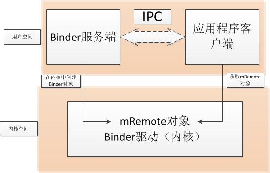
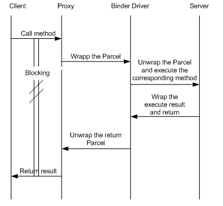

# IPC、Binder、AIDL与Intent之间区别与联系

[TOC]

[原文地址 - danlov](http://danlov.iteye.com/blog/2191704)

很多文章提到的的IPC、Binder、AIDL都是混在一起说，有时候好像觉得它们是一样的，但是又有区别，那倒底有什么共同点与不同呢，还有Intent与它们有什么关系呢？

首先看看各自的全称与中文名：

* IPC: Inter-Process Communication(进程间通信)
* Binder: Binder 进程间通信机制
* AIDL: Android Interface Definition Language(android接口定义语言)
* Intent: 意图

再来看一张图：


图中最里层是Android系统匿名共享内存Ashmem（Anonymous Shared Memory），其作用之一即通过Binder进程间通信机制来实现进程间的内存共享。

通过图片与其名称，其实已经能知道个大概：

IPC是一种概念，即进程间通信；其它几个都是Android里的概念；Binder是对IPC的具体实行，是IPC的一种具体实现；AIDL是Binder机制向外提供的接口，目的就是为了方便对Binder的使用；**Intent是最高层级的封装，实质是封装了对Binder的使用，当然Intent也常常在同一进程中调用，只是把两种方式封装在一起了**。

为什么搞这么复杂呢，目的还是为了最大发挥系统效率与方便开发者使用。

IPC是操作系统层面的概念，因为进程是操作系统里最基本的单位，**进程的一大特征就是有自己独立的内存地址空间，所以同一进程里的代码能直接访问其地址空间的内存，而其它进程是不能直接访问的**。操作系统是多进程的，多个进程配合工作肯定会涉及到互相的通信，故出现了IPC，而对IPC的实现也不是一种，有很多，且有各自的长处，比如Socket就是一种IPC，其长处就是能跨机器进行进程间通信。

Android系统的本质上其实是Linux系统，可以看成是在Linux内核上运行着一个超级程序。虽然Linux本身提供了很多IPC机制，但是Android主要是运行在手机上了，为了能更好的适应手机这个环境同时简化开发，Binder机制出现了，**而Binder本质上是通过共享内存来实现的IPC( 直白点就是一段物理内存在不同进程中都映射了虚拟地址（虚拟地址可能不同），一个对它写，另一个对它读，然后解析、处理)**，但是Binder机制不是简简单单共享内存，而是搭了一套巧妙的架构，来达到最终共享内存进行IPC的目的。

## Binder

Binder机制具体的实现涉及到很多C/C++的代码，我们了解一下其思想就行了：

Binder通信采用的是 **client-server通信结构**，client与server的通信由Binder驱动程序和Service Manager组件协助，这两个组件Android已经实现好了并由系统运行，而开发者只需要按照框架规范实现client与server接口即可。参考下图：



具体的通信过程如下图：



什么意思呢：

1. `client` 通过获得一个 `server` 的代理借口，对 `server` 进行直接调用；
2. 实际上代理接口中定义的方法与 `server` 中定义的方法是一一对应的；
3. `client` 调用某个代理接口中的方法时，代理接口的方法会将 `client` 传递的参数打包成为Parcel对象；
4. 代理接口将该 `Parcel` 发送给内核中的 `binder driver`；
5. `server` 会读取 `binder driver` 中的请求数据，如果是发送给自己的，解包 `Parcel` 对象，处理并将结果返回；
6. 整个的调用过程是一个同步过程，在 `server` 处理的时候，`client` 会 `block` 住。

## AIDL

AIDL是为了方便使用 `Binder` 框架搞的一个东东，其实不用这个也能达到目的，但是用这个就简化了操作。 只要按照规范写一个.aidl文件，插件会帮助自动创建一个与interface同名的.java文件，里面已经帮我们自动写好一堆东东，这些标准化的东西，用模板自动生成即可，让开发者尽量关注功能实现上。

`.aidl` 的写法非常简单，与 `java` 接口的定义很类似：

比如：

```java
interface MyAidl{    
    int getId();  
      
    void setId(int id);  
  }  
```

自动生成的 `.java` 中有一个重要的内部类 `Stub`，其继承了 `Binder` 类，需要实现我们定义的 `interface`，比如：

```java
public static abstract class Stub extends android.os.Binder implements com.xxx.MyAidl {  
     public static com.xxx.MyAidl asInterface(android.os.IBinder obj);  
     public boolean onTransact(int code, android.os.Parcel data,android.os.Parcel reply, int flags);  
  
     private static class Proxy implements com.hsae.recorder.encoder.Mp4EncoderAidl {  
            ......  
      }  
  }  
```

Binder类既作为服务器端接口也作为Binder驱动，客户端接口会获得Binder驱动，调用其 `transact()` 发送消息至服务器，而服务器端接口会接收Binder驱动发送的消息，收到消息后，会执行Binder对象中的 `onTransact()` 函数，并按照该函数的参数执行不同的服务器端代码。

Proxy实例中会传入Binder驱动，并且封装了调用服务端的代码，客户端会通过Binder驱动的 `transact()` 方法调用服务端代码。

最后分析得出，客户端中获取的就是Proxy实例。

## Intent

Intent进行进程间通信比较常见，比如打开另一个应用的Activity、发送广播等。Intent的架构包括三方面：

1. Client：发送这个 `Intent` 的 `activity`；
2. Server：`ActivityManagerService.java(AMS)`，它主要负责分发这些 `Intent` 给适当的对象；
3. Target：也就是那些需要处理这个 `Intent` 的 `activity`，称为 `Receiver`。

**而进程间发送消息或者 `broadcast`，并不是直接把 `intent` 发过去，而是把 `intent` 打包到 `Parcel` 中，通过 `binder` 机制传递消息。**