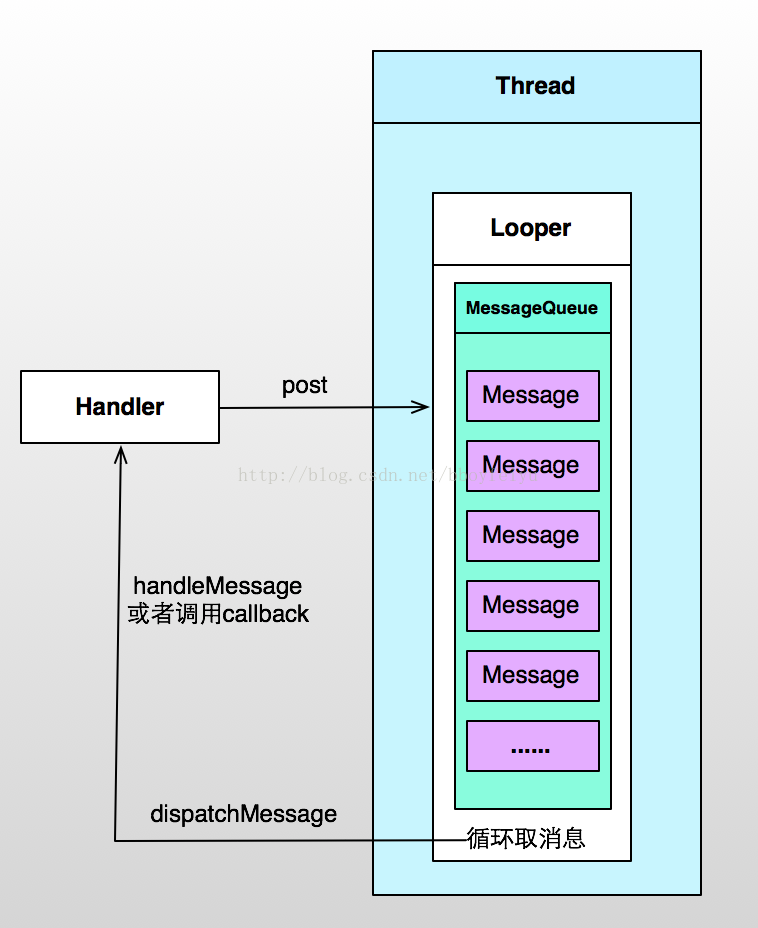

# Android 中 Thread、Handler、Looper、MessageQueue 的原理分析

[TOC]

[原文地址 - Mr.Simple的专栏](https://blog.csdn.net/bboyfeiyu/article/details/38555547)

在 Android 开发当中，`Thread`、`Handler`、`Looper` 这几个类是特别常见，在刚开始学习 Android 的时候对这些类可能并不是很清晰。下面我们就一起从源码的角度剖析一下这几个类的工作原理。

## Thread

首先是 `Thread`, 我们都知道一个 `Thread` 就是一个线程对象，只要在 `run方法` 中填写自己的代码然后启动该线程就可以实现多线程操作。例如:

```java

new Thread(){
    public void run() {
        // 耗时的操作
    };
}.start();

```

我们知道，针对上面的代码中，当执行完 `run` 中的操作时，整个线程就会结束，并不会一直执行下去。而我们的应用程序会一直执行，除非你退出或者应用程序抛出异常。这又引入了另外一个概念，即消息队列。在 Android 应用启动时，会默认有一个主线程 `(UI线程)`，在这个线程中会关联一个消息队列，所有的操作都会被封装成消息然后交给主线程来处理。为了保证主线程不会主动退出，会将取消息的操作放在一个死循环中，这样程序就相当于一直在执行死循环，因此不会退出。

实例图如下：

